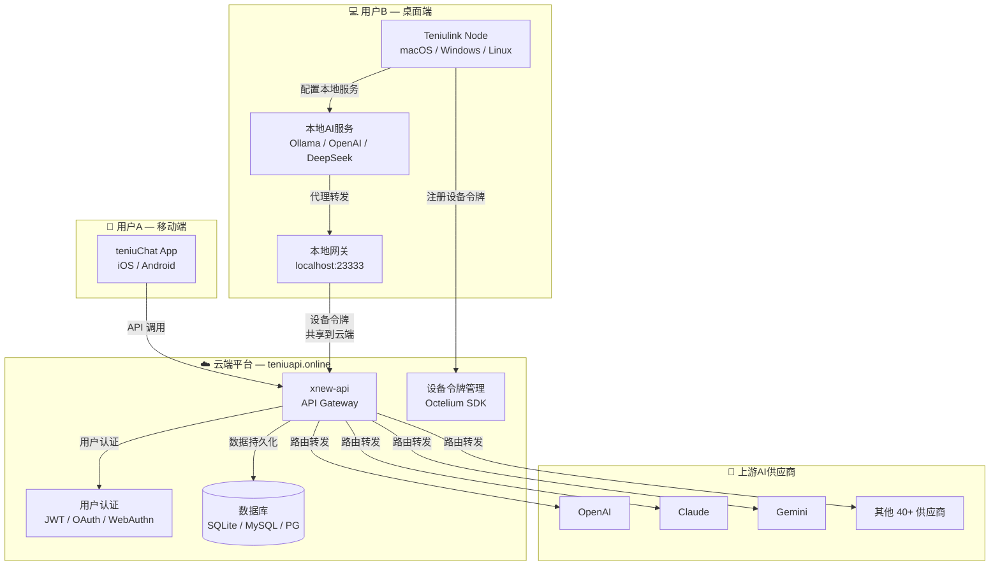

<div align="center">

# Teniu.AI

**去中心化 LLM Token / GPU 共享网络 · Decentralized LLM Token & GPU Sharing Network**

<p align="center">
  <a href="https://github.com/liuyaaixxa/xnew-api">
    
  </a>
  <a href="./LICENSE">
    
  </a>
</p>

<p align="center">
  <a href="#-项目简介">项目简介</a> •
  <a href="#-系统架构">系统架构</a> •
  <a href="#-用户场景">用户场景</a> •
  <a href="#-核心能力">核心能力</a> •
  <a href="#-快速开始">快速开始</a> •
  <a href="#-teniu-link-客户端">客户端下载</a> •
  <a href="#-技术架构">技术架构</a>
</p>

</div>

---

## 📝 项目简介

**Teniu.AI** 是一个去中心化的 LLM Token / GPU 共享网络平台，具备双重核心场景：

- **共享赚钱** — 将您闲置的 GPU 算力或 LLM Token 接入 Teniu.AI 网络，按贡献获取收益
- **低价使用** — 以极低成本使用 GPT-4o、Claude、Gemini 等主流大模型 API，兼容 OpenAI 格式，即开即用

同时，Teniu.AI 也是一个统一的大模型 API 网关，聚合 40+ 上游 AI 供应商（OpenAI、Claude、Gemini、Azure、AWS Bedrock 等），提供统一接口、用户管理、计费、限流和管理后台。

---

## 🏗️ 系统架构



### 相关仓库

项目由三个代码仓库协同工作：

| 仓库 | 定位 | 说明 |
|------|------|------|
| **[xnew-api](https://github.com/liuyaaixxa/xnew-api)** | ☁️ 云端网关 | API 网关，部署于 [teniuapi.online](https://teniuapi.online)，统一 AI 模型接入、用户认证、设备令牌管理、计费 |
| **[teniu-chat](https://github.com/liuyaaixxa/teniu-chat)** | 📱 移动客户端 | iOS / Android App，终端用户通过它接入 Teniu.AI 网络消费大模型服务 |
| **[teniulink-node-client](https://github.com/liuyaaixxa/teniulink-node-client)** | 💻 桌面节点 | 桌面应用，在本地启动智能网关，将本地 AI 服务共享到云端 |

---

## 👥 用户场景

### 用户A — 移动端消费者

1. 通过 **teniuChat App**（iOS / Android）注册或登录账户
2. 认证方式：GitHub / Discord / 邮箱注册 / Openfort 钱包登录
3. 在 App 中浏览可用 AI 模型（上游供应商 + 用户 B 共享的本地服务）
4. 直接调用模型，云端网关统一鉴权、计费、路由

### 用户B — 桌面端节点提供者

1. 下载并启动 **Teniulink Node** 桌面应用
2. 在「模型服务」菜单中配置本地 AI 服务（OpenAI、Google、DeepSeek、Ollama 等）
3. 本地启动智能网关 `http://localhost:23333`，代理所有已配置的本地服务
4. 登录云端 [teniuapi.online](https://teniuapi.online)，创建**设备令牌**
5. 在 Teniulink Node 中填入设备令牌，将本地 `23333` 端口服务共享至云端
6. 其他用户（用户 A）即可通过云端消费您共享的大模型服务

---

## ✨ 核心能力

### 🔗 去中心化共享网络

| 能力 | 说明 |
|------|------|
| **LLM Token 共享** | 共享您的闲置 LLM API Token，为其他用户提供低价模型调用 |
| **GPU 算力共享** | 将闲置 GPU 接入网络，托管 Ollama 本地模型赚取收益 |
| **实时结算** | 智能合约自动结算，实时查看收益，支持多种提现方式 |
| **全球网络** | 节点遍布全球，确保低延迟和高可用性 |

### 💰 低价 Token 使用

通过 3 步即可享用低价大模型 API：

1. **注册并获取 API Key** — 创建账户，在控制台一键生成 API Key
2. **选择模型与充值** — 浏览模型广场，选择 GPT-4o、Claude、Gemini 等主流模型，按需充值
3. **替换 API 地址调用** — 将 API Base URL 替换为 Teniu.AI 地址，无需修改代码即可无缝切换

### 🤖 多供应商聚合网关

- **40+ AI 供应商** 统一接入，一个 API 地址访问所有模型
- **格式自动转换** — OpenAI ⇄ Claude Messages ⇄ Google Gemini 格式互转
- **智能路由** — 渠道加权随机、失败自动重试、用户级模型限流
- **订阅套餐** — 免费 / 基础 / 专业 / 企业四档共享入驻套餐

### 🛡️ 安全与管理

- **WebAuthn/Passkeys** — 无密码安全登录
- **OAuth 集成** — GitHub、Discord、LinuxDO、Telegram、OIDC
- **完整管理后台** — 数据看板、令牌管理、渠道管理、用户管理、计费系统
- **设备令牌管理** — 集成 Octelium SDK，生成设备 auth-token，支持节点连接

### 🔄 API 格式支持

- OpenAI Chat Completions & Responses
- OpenAI Realtime API（含 Azure）
- Claude Messages
- Google Gemini
- Rerank 模型（Cohere、Jina）
- Midjourney-Proxy / Suno-API
- 思考模型（Reasoning Effort）支持

---

## 🖥️ Teniu Link 客户端

**Teniu Link** 是节点客户端（Agent GateWay + ChatBox），用于将您的设备连接到 Teniu.AI 网络。

| 平台 | 下载 |
|------|------|
| **macOS** | [DMG · ARM64](https://github.com/liuyaaixxa/teniulink-node-client/releases/download/v0.1.0/Teniulink-Node-0.1.0-arm64.dmg) · [DMG · x64](https://github.com/liuyaaixxa/teniulink-node-client/releases/download/v0.1.0/Teniulink-Node-0.1.0-x64.dmg) |
| **Windows** | [Setup · x64](https://github.com/liuyaaixxa/teniulink-node-client/releases/download/v0.1.0/Teniulink-Node-0.1.0-x64-setup.exe) · [Portable · x64](https://github.com/liuyaaixxa/teniulink-node-client/releases/download/v0.1.0/Teniulink-Node-0.1.0-x64-portable.exe) |
| **Linux** | [DEB · amd64](https://github.com/liuyaaixxa/teniulink-node-client/releases/download/v0.1.0/Teniulink-Node-0.1.0-amd64.deb) · [RPM · x86_64](https://github.com/liuyaaixxa/teniulink-node-client/releases/download/v0.1.0/Teniulink-Node-0.1.0-x86_64.rpm) |

---

## 🛠️ 技术架构

| 层级 | 技术 |
|------|------|
| 后端 | Go 1.25+, Gin, GORM v2 |
| 前端 | React 18, Vite, Semi Design |
| 数据库 | SQLite / MySQL / PostgreSQL |
| 缓存 | Redis + 内存缓存 |
| 认证 | JWT, WebAuthn/Passkeys, OAuth |
| 设备集成 | Octelium gRPC SDK |
| 国际化 | go-i18n (后端), i18next (前端) — 中/英/日/法/俄/越 |

---

## 🚀 快速开始

### Docker Compose（推荐）

```bash
# 克隆项目
git clone https://github.com/liuyaaixxa/xnew-api.git
cd xnew-api

# 启动服务
docker-compose up -d

# 访问
open http://localhost:3000
```

### Docker 命令

```bash
# 使用 SQLite（默认）
docker run --name teniu-ai -d --restart always \
  -p 3000:3000 \
  -e TZ=Asia/Shanghai \
  -v ./data:/data \
  calciumion/new-api:latest

# 使用 MySQL
docker run --name teniu-ai -d --restart always \
  -p 3000:3000 \
  -e SQL_DSN="root:123456@tcp(localhost:3306)/oneapi" \
  -e TZ=Asia/Shanghai \
  -v ./data:/data \
  calciumion/new-api:latest
```

### 环境变量

| 变量 | 说明 | 默认值 |
|------|------|--------|
| `SQL_DSN` | 数据库连接字符串 | SQLite |
| `REDIS_CONN_STRING` | Redis 连接 | - |
| `SESSION_SECRET` | 会话密钥（多机部署必须） | - |
| `CRYPTO_SECRET` | 加密密钥（Redis 必须） | - |
| `OCTELIUM_AUTH_TOKEN` | Octelium 管理员 auth-token | - |
| `OCTELIUM_DEFAULT_DOMAIN` | Octelium 默认域名 | `teniuapi.cloud` |

---

## 🤖 支持的模型供应商

OpenAI · Azure OpenAI · Anthropic Claude · Google Gemini · AWS Bedrock · Cohere · Mistral · Moonshot · DeepSeek · 智谱 GLM · 百川 · 通义千问 · 讯飞星火 · 零一万物 · MiniMax · Groq · Ollama · Cloudflare Workers AI · Coze · Midjourney · Suno 等 40+ 供应商

---

## 📜 许可证

本项目遵循 [GNU Affero General Public License v3.0 (AGPLv3)](./LICENSE)。

基于 [New API](https://github.com/Calcium-Ion/new-api)（由 [QuantumNous](https://github.com/QuantumNous) 维护）二次开发，原项目基于 [One API](https://github.com/songquanpeng/one-api)（MIT License）。

---

<div align="center">
<sub>Built by Teniu.AI Team</sub>
</div>
