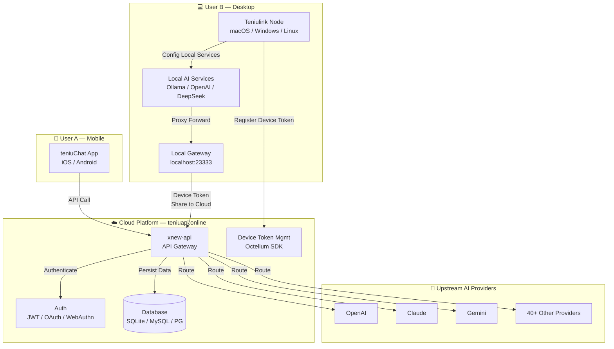

<div align="center">

# Teniu.AI

**Decentralized LLM Token & GPU Sharing Network**

<p align="center">
  <strong>English</strong> |
  <a href="./README.zh_CN.md">简体中文</a> |
  <a href="./README.zh_TW.md">繁體中文</a> |
  <a href="./README.ja.md">日本語</a> |
  <a href="./README.fr.md">Français</a>
</p>

<p align="center">
  <a href="https://github.com/liuyaaixxa/xnew-api">
    
  </a>
  <a href="./LICENSE">
    
  </a>
</p>

<p align="center">
  <a href="#-introduction">Introduction</a> •
  <a href="#-architecture">Architecture</a> •
  <a href="#-user-scenarios">User Scenarios</a> •
  <a href="#-core-capabilities">Core Capabilities</a> •
  <a href="#-quick-start">Quick Start</a> •
  <a href="#-teniu-link-client">Client Download</a> •
  <a href="#-tech-stack">Tech Stack</a>
</p>

</div>

---

## 📝 Introduction

**Teniu.AI** is a decentralized LLM Token / GPU sharing network with two core scenarios:

- **Earn by Sharing** — Connect your idle GPU compute or LLM API tokens to the Teniu.AI network and earn rewards
- **Low-Cost Access** — Use GPT-4o, Claude, Gemini, and other leading AI models at a fraction of the cost, with full OpenAI API compatibility

Teniu.AI is also a unified AI API gateway aggregating 40+ upstream providers (OpenAI, Claude, Gemini, Azure, AWS Bedrock, etc.), offering a single interface with user management, billing, rate limiting, and an admin dashboard.

---

## 🏗️ Architecture



### Related Repositories

The project is composed of three repositories working together:

| Repository | Role | Description |
|------|------|------|
| **[xnew-api](https://github.com/liuyaaixxa/xnew-api)** | ☁️ Cloud Gateway | API gateway deployed at [teniuapi.online](https://teniuapi.online) — unified AI model access, user auth, device token management, billing |
| **[teniu-chat](https://github.com/liuyaaixxa/teniu-chat)** | 📱 Mobile Client | iOS / Android app for end users to access the Teniu.AI network and consume AI services |
| **[teniulink-node-client](https://github.com/liuyaaixxa/teniulink-node-client)** | 💻 Desktop Node | Desktop app that starts a local smart gateway and shares local AI services to the cloud |

---

## 👥 User Scenarios

### User A — Mobile Consumer

1. Register or log in via **teniuChat App** (iOS / Android)
2. Auth methods: GitHub / Discord / Email / Openfort Wallet
3. Browse available AI models (upstream providers + services shared by User B)
4. Call models directly — the cloud gateway handles auth, billing, and routing transparently

### User B — Desktop Node Provider

1. Download and launch **Teniulink Node** desktop app
2. Configure local AI services in the "Model Services" menu (OpenAI, Google, DeepSeek, Ollama, etc.)
3. Start the local smart gateway at `http://localhost:23333` — it proxies all configured services
4. Log in to [teniuapi.online](https://teniuapi.online) and create a **Device Token**
5. Enter the device token in Teniulink Node to share your local `23333` port service to the cloud
6. Other users (User A) can now consume your shared AI services through the cloud

---

## ✨ Core Capabilities

### 🔗 Decentralized Sharing Network

| Capability | Description |
|------|------|
| **LLM Token Sharing** | Share your idle LLM API tokens and provide low-cost model access to other users |
| **GPU Compute Sharing** | Connect idle GPUs to the network, host Ollama local models, and earn rewards |
| **Real-Time Settlement** | Smart contract-based automatic settlement with real-time earnings dashboard |
| **Global Network** | Nodes distributed worldwide ensuring low latency and high availability |

### 💰 Low-Cost Token Usage

Get started with affordable AI APIs in 3 steps:

1. **Register & Get API Key** — Create an account and generate an API key from the dashboard
2. **Choose Models & Top Up** — Browse the model marketplace, pick GPT-4o, Claude, Gemini, etc., and top up as needed
3. **Swap API Base URL** — Replace your API base URL with Teniu.AI — no code changes required

### 🤖 Multi-Provider Gateway

- **40+ AI Providers** unified under a single API endpoint
- **Auto Format Conversion** — OpenAI ⇄ Claude Messages ⇄ Google Gemini
- **Smart Routing** — Weighted random channel selection, auto retry on failure, per-user model rate limiting
- **Subscription Plans** — Free / Basic / Pro / Enterprise tiers

### 🛡️ Security & Management

- **WebAuthn/Passkeys** — Passwordless secure login
- **OAuth Integration** — GitHub, Discord, LinuxDO, Telegram, OIDC
- **Admin Dashboard** — Analytics, token management, channel management, user management, billing
- **Device Token Management** — Octelium SDK integration for device auth-token generation and node connectivity

### 🔄 API Format Support

- OpenAI Chat Completions & Responses
- OpenAI Realtime API (including Azure)
- Claude Messages
- Google Gemini
- Rerank Models (Cohere, Jina)
- Midjourney-Proxy / Suno-API
- Reasoning Effort support

---

## 🖥️ Teniu Link Client

**Teniu Link** is the desktop node client (Agent Gateway + ChatBox) for connecting your device to the Teniu.AI network.

| Platform | Download |
|------|------|
| **macOS** | [DMG · ARM64](https://github.com/liuyaaixxa/teniulink-node-client/releases/download/v0.1.0/Teniulink-Node-0.1.0-arm64.dmg) · [DMG · x64](https://github.com/liuyaaixxa/teniulink-node-client/releases/download/v0.1.0/Teniulink-Node-0.1.0-x64.dmg) |
| **Windows** | [Setup · x64](https://github.com/liuyaaixxa/teniulink-node-client/releases/download/v0.1.0/Teniulink-Node-0.1.0-x64-setup.exe) · [Portable · x64](https://github.com/liuyaaixxa/teniulink-node-client/releases/download/v0.1.0/Teniulink-Node-0.1.0-x64-portable.exe) |
| **Linux** | [DEB · amd64](https://github.com/liuyaaixxa/teniulink-node-client/releases/download/v0.1.0/Teniulink-Node-0.1.0-amd64.deb) · [RPM · x86_64](https://github.com/liuyaaixxa/teniulink-node-client/releases/download/v0.1.0/Teniulink-Node-0.1.0-x86_64.rpm) |

---

## 🛠️ Tech Stack

| Layer | Technology |
|------|------|
| Backend | Go 1.25+, Gin, GORM v2 |
| Frontend | React 18, Vite, Semi Design |
| Database | SQLite / MySQL / PostgreSQL |
| Cache | Redis + In-Memory Cache |
| Auth | JWT, WebAuthn/Passkeys, OAuth |
| Device Integration | Octelium gRPC SDK |
| i18n | go-i18n (backend), i18next (frontend) — zh/en/ja/fr/ru/vi |

---

## 🚀 Quick Start

### Docker Compose (Recommended)

```bash
# Clone the project
git clone https://github.com/liuyaaixxa/xnew-api.git
cd xnew-api

# Start services
docker-compose up -d

# Open in browser
open http://localhost:3000
```

### Docker Run

```bash
# Using SQLite (default)
docker run --name teniu-ai -d --restart always \
  -p 3000:3000 \
  -e TZ=Asia/Shanghai \
  -v ./data:/data \
  calciumion/new-api:latest

# Using MySQL
docker run --name teniu-ai -d --restart always \
  -p 3000:3000 \
  -e SQL_DSN="root:123456@tcp(localhost:3306)/oneapi" \
  -e TZ=Asia/Shanghai \
  -v ./data:/data \
  calciumion/new-api:latest
```

### Environment Variables

| Variable | Description | Default |
|------|------|--------|
| `SQL_DSN` | Database connection string | SQLite |
| `REDIS_CONN_STRING` | Redis connection | - |
| `SESSION_SECRET` | Session secret (required for multi-node deployment) | - |
| `CRYPTO_SECRET` | Encryption secret (required for Redis) | - |
| `OCTELIUM_AUTH_TOKEN` | Octelium admin auth-token | - |
| `OCTELIUM_DEFAULT_DOMAIN` | Octelium default domain | `teniuapi.cloud` |

---

## 🤖 Supported Model Providers

OpenAI · Azure OpenAI · Anthropic Claude · Google Gemini · AWS Bedrock · Cohere · Mistral · Moonshot · DeepSeek · Zhipu GLM · Baichuan · Tongyi Qianwen · iFlytek Spark · 01.AI · MiniMax · Groq · Ollama · Cloudflare Workers AI · Coze · Midjourney · Suno and 40+ more

---

## 📜 License

This project is licensed under the [GNU Affero General Public License v3.0 (AGPLv3)](./LICENSE).

Built on [New API](https://github.com/Calcium-Ion/new-api) (maintained by [QuantumNous](https://github.com/QuantumNous)), which was originally based on [One API](https://github.com/songquanpeng/one-api) (MIT License).

---

<div align="center">
<sub>Built by Teniu.AI Team</sub>
</div>
